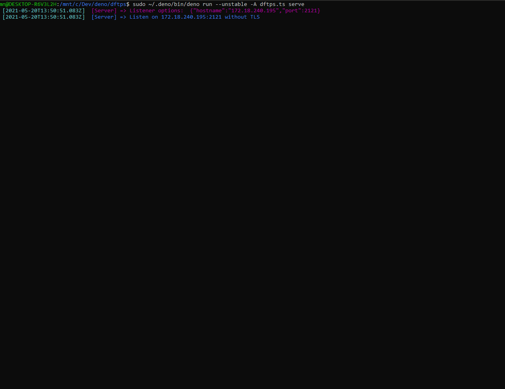

# DFtpS - Deno Ftp Server


[](https://doc.deno.land/https/deno.land/x/dftps/mod.ts)
  
DFtpS is an FTP server based on [ftp-srv](https://github.com/autovance/ftp-srv) with Deno.

- [Install](#install)
- [Make your own](#make-your-own)
- [Deno Dependencies](#deno-dependencies)
- [List of FTP commands](#list-of-ftp-commands)
- [Contributing](#contributing)
- [References](#references)

## Usage

### Install

```sh
curl -fsSL https://deno.land/x/dftps/install.sh | sh
```

### Install Specific Version

```sh
curl -fsSL https://deno.land/x/dftps/install.sh | sh -s v1.0.0
```

* * *

## Make your own

### Simple

```ts
import { Server } from "https://deno.land/x/dftps/server/mod.ts";
import type { UsernameResolvable, LoginResolvable } from "https://deno.land/x/dftps/server/connection.ts";

const serve = new Server({
  port: 21,
  hostname: "127.0.0.1" // (optional)
}, {
  /** Url for passive connection. */
  pasvUrl?: string; // (optional)
  /** Minimum port for passive connection. */
  pasvMin?: number; // (optional)
  /** Maximum port for passive connection. */
  pasvMax?: number; // (optional)
  /** Handle anonymous connexion. */
  anonymous?: boolean; // (optional)
  /** Sets the format to use for file stat queries such as "LIST". */
  fileFormat?: string; // (optional)
  /** Array of commands that are not allowed */
  blacklist?: string[];
});

for await (const connection of serve) {
  const { awaitUsername, awaitLogin } = connection;
  /** waiting to receiving username from connection */
  awaitUsername.then(({ username, resolveUsername }: UsernameResolvable) => {
    if (!username !== "my-username") return resolveUsername.reject("Incorrect username!");
    resolveUsername.resolve();
  });
  /** waiting to receiving password from connection and finalize the user authenticate */
  awaitLogin.then(async ({ password, resolvePassword }: LoginResolvable) => {
    if (password !== "my-password") return resolvePassword.reject("Wrong password!");
    resolvePassword.resolve({ root: "my-folder", uid: 1000, gid: 1000 });
  });
}
```

### With database

```ts
import { Server } from "https://deno.land/x/dftps/server/mod.ts";
import type { UsernameResolvable, LoginResolvable } from "https://deno.land/x/dftps/server/connection.ts";

import createDb from "../db/mod.ts";
import Users from "../db/Users.ts";

await createDb({
  connector: "MariaDB" | "MongoDB" | "MySQL" | "PostgreSQL" | "SQLite",

  /* Maria, MySQL, PostgreSQL Example
  database: 'my-database',
  host: 'url-to-db.com',
  username: 'username',
  password: 'password',
  port: 3306 // (optional)
  */

  /* MongoDB Example
  uri: 'mongodb://127.0.0.1:27017',
  database: 'test'
  */

  /* SQLite Example
  filepath: './database.sqlite'
  */
});

const serve = new Server({
  port: 21,
  hostname: "127.0.0.1" // (optional)
}, {
  /** Url for passive connection. */
  pasvUrl: string, // (optional)
  /** Minimum port for passive connection. */
  pasvMin: number, // (optional)
  /** Maximum port for passive connection. */
  pasvMax: number, // (optional)
  /** Handle anonymous connexion. */
  anonymous: boolean, // (optional)
  /** Sets the format to use for file stat queries such as "LIST". */
  fileFormat: string, // (optional)
  /** Array of commands that are not allowed */
  blacklist: string[] // (optional)
});

for await (const connection of serve) {
  const { awaitUsername, awaitLogin } = connection;
  /** Get all users in database */
  const users = await Users.select("username", "password", "root", "uid", "gid").all();
  let user: Model;
  /** Waiting to receiving username from connection */
  awaitUsername.then(({ username, resolveUsername }: UsernameResolvable) => {
      const found = users.find(u => u.username === username);
      if (!found) return resolveUsername.reject("Incorrect username!");
      user = found;
      resolveUsername.resolve();
  });
  /** Waiting to receiving password from connection and finalize the user authenticate */
  awaitLogin.then(async ({ password, resolvePassword }: LoginResolvable) => {
      if (!user) return resolvePassword.reject("User not found!");
      if (! await verify(password, (user.password as string))) return resolvePassword.reject("Wrong password!");

      const { root, uid, gid } = user;
      resolvePassword.resolve({ root: (root as string), uid: (uid as number), gid: (gid as number) });
  });
}
```

## Log example



* * *

## Deno Dependencies

- ### [Deno](https://deno.land)

  - [async](https://deno.land/std@0.95.0/async)
  - [io](https://deno.land/std@0.95.0/io)
  - [path](https://deno.land/std@0.95.0/path)
  - [fs](https://deno.land/std@0.95.0/fs)
  - [datetime](https://deno.land/std@0.96.0/datetime)

- ### [getport](https://deno.land/x/getport)

- ### [cliffy](https://deno.land/x/cliffy)

- ### [scrypt](https://deno.land/x/scrypt)

- ### [denodb](https://deno.land/x/denodb)

## [List of FTP commands](https://en.wikipedia.org/wiki/List_of_FTP_commands)

See [COMMANDS.md](COMMANDS.md)

## Contributing

See [CONTRIBUTING.md](CONTRIBUTING.md)

## References

- [Ftp](https://cr.yp.to/ftp.html)
- [Ftp commands](https://en.wikipedia.org/wiki/List_of_FTP_commands)
- [Ftp reply codes](https://en.wikipedia.org/wiki/List_of_FTP_server_return_codes)
